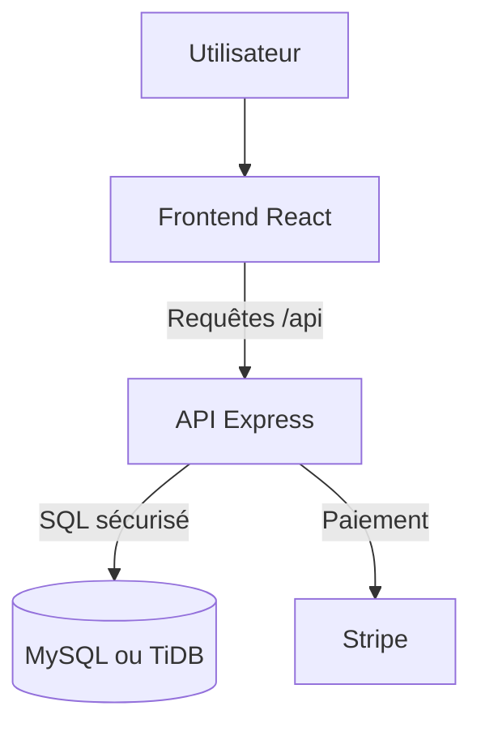

# LeLocal

Plateforme web full-stack destinée à un tiers-lieu associatif. LeLocal permet de découvrir et réserver des espaces, consulter les événements et ateliers, gérer un panier, payer une réservation et suivre son activité depuis un tableau de bord.

**Application en ligne :** [lelocal-client-tententsx.vercel.app](https://lelocal-client-tententsx.vercel.app/)

## Sommaire

- [Présentation](#présentation)
- [Fonctionnalités](#fonctionnalités)
- [Stack technique](#stack-technique)
- [Architecture](#architecture)
- [Installation locale](#installation-locale)
- [Variables d'environnement](#variables-denvironnement)
- [Base de données](#base-de-données)
- [Commandes disponibles](#commandes-disponibles)
- [API](#api)
- [Déploiement](#déploiement)
- [Structure du projet](#structure-du-projet)
- [Sécurité](#sécurité)
- [Limites connues](#limites-connues)

## Présentation

LeLocal centralise les services d'un tiers-lieu :

- découverte des espaces de coworking, studios, salles et ateliers ;
- consultation des disponibilités et des événements ;
- création de compte et authentification par rôle ;
- réservation et gestion du panier ;
- paiement en ligne avec Stripe ;
- suivi des réservations, factures et réclamations ;
- proposition d'événements par les membres ;
- administration des demandes, réservations et statistiques.

Le projet a été réalisé en équipe dans le cadre de la formation Développeur web et web mobile de la Wild Code School.

## Fonctionnalités

### Visiteur

- consulter les espaces, événements et ateliers ;
- filtrer les espaces par catégorie ;
- consulter les créneaux et disponibilités ;
- créer un compte ou se connecter.

### Client authentifié

- réserver un espace ou s'inscrire à un événement ;
- ajouter, modifier et supprimer des éléments du panier ;
- régler une réservation ;
- consulter ses réservations passées et à venir ;
- accéder à son historique de facturation ;
- envoyer une réclamation ;
- proposer un événement avec une image.

### Administrateur

- consulter les statistiques du tiers-lieu ;
- suivre les réservations et le taux d'occupation ;
- consulter et traiter les réclamations ;
- accepter ou refuser les demandes d'événements ;
- créer des événements.

## Stack technique

| Partie | Technologies |
|---|---|
| Frontend | React 19, TypeScript, Vite, React Router, CSS |
| Backend | Node.js, Express, TypeScript |
| Base de données | MySQL en local, TiDB Cloud en production |
| Accès aux données | `mysql2/promise`, requêtes SQL paramétrées |
| Authentification | JWT, Argon2, rôles `client` et `admin` |
| Paiement | Stripe |
| Validation et qualité | Joi, Biome, TypeScript, Jest, Supertest |
| Déploiement | Vercel pour React et Express, TiDB Cloud pour les données |

## Architecture

LeLocal est organisé en monorepo avec deux workspaces npm : `client` et `server`.



En production, le frontend et l'API utilisent le même domaine Vercel. Les appels du navigateur sont donc effectués avec des chemins relatifs comme `/api/events`.

## Installation locale

### Prérequis

- Node.js 20 ou version supérieure ;
- npm ;
- MySQL en fonctionnement ;
- Git.

### Mise en place

```bash
git clone git@github.com:TentenTSX/Lelocal.git
cd Lelocal
npm install
```

Crée ensuite les fichiers d'environnement à partir des exemples :

```bash
cp server/.env.sample server/.env
cp client/.env.sample client/.env
```

Renseigne les valeurs locales dans les deux fichiers, puis initialise la base uniquement si nécessaire :

```bash
npm run db:migrate
npm run dev
```

L'application locale utilise par défaut :

- frontend : `http://localhost:3000` ;
- backend : `http://localhost:3310`.

> **Attention :** la migration actuelle supprime et recrée la base indiquée par `DB_NAME`. Elle est réservée à une base locale de développement. Ne l'exécute jamais avec les identifiants TiDB de production.

## Variables d'environnement

### Serveur — `server/.env`

```dotenv
APP_PORT=3310

DB_HOST=localhost
DB_PORT=3306
DB_USER=your_local_user
DB_PASSWORD=your_local_password
DB_NAME=lelocal
DB_SSL=false

JWT_SECRET=generate_a_long_random_secret
JWT_EXPIRES_IN=30d

CLIENT_URL=http://localhost:3000
STRIPE_SECRET_KEY=sk_test_xxx
```

### Client — `client/.env`

```dotenv
VITE_API_URL=http://localhost:3310
VITE_STRIPE_PUBLIC_KEY=pk_test_xxx
```

En production, `VITE_API_URL` doit être absente ou vide : Vercel expose déjà l'API sous le même domaine avec le préfixe `/api`.

Ne versionne jamais les véritables fichiers `.env`. Les fichiers `.env.sample` documentent uniquement les noms attendus.

## Base de données

Le schéma relationnel se trouve dans [`server/database/schema.sql`](server/database/schema.sql). Les principales tables sont :

- `users` : comptes clients et administrateurs ;
- `space` : espaces, salles, studios et ateliers ;
- `time_slot` : créneaux disponibles ;
- `activity` : événements et activités réservables ;
- `cart` : panier temporaire ;
- `booking` : réservations validées ;
- `claim` : réclamations clients.

Deux environnements de données sont utilisés :

| Environnement | Base | Configuration |
|---|---|---|
| Développement | MySQL sur la machine locale | `server/.env` |
| Production | TiDB Cloud | Variables d'environnement Vercel |

Ces deux bases sont indépendantes. Une modification locale n'est pas automatiquement synchronisée avec TiDB.

## Commandes disponibles

| Commande | Description |
|---|---|
| `npm install` | Installe les dépendances des deux workspaces |
| `npm run dev` | Démarre le frontend et le backend simultanément |
| `npm run dev:client` | Démarre uniquement Vite |
| `npm run dev:server` | Démarre uniquement Express |
| `npm run build` | Compile les workspaces disponibles |
| `npm run check` | Exécute Biome et les vérifications TypeScript |
| `npm run check:fix` | Corrige automatiquement les problèmes pris en charge par Biome |
| `npm run test` | Exécute les tests disponibles |
| `npm run db:migrate` | Recrée la base locale depuis `schema.sql` |
| `npm run db:seed` | Ajoute les données de démonstration prévues par le projet |

## API

Toutes les routes sont préfixées par `/api`.

| Domaine | Exemples de routes |
|---|---|
| Santé | `GET /api/health` |
| Authentification | `POST /api/auth/register`, `POST /api/auth/login/client`, `GET /api/auth/me` |
| Espaces | `GET /api/spaces`, `GET /api/spaces/:id/availability` |
| Événements | `GET /api/events`, `GET /api/events/:date`, `POST /api/events/:id` |
| Panier | `GET /api/cart/:userId`, `POST /api/cart`, `PATCH /api/cart/:id` |
| Réservations | `POST /api/bookings`, `POST /api/booking` |
| Paiement | `POST /api/payment/create-intent` |
| Dashboard client | `/api/dashboard/client/*` |
| Dashboard admin | `/api/dashboard/admin/*` |

Les routes protégées attendent un JWT dans l'en-tête :

```http
Authorization: Bearer <token>
```

## Déploiement

### Vercel

Le fichier [`vercel.json`](vercel.json) configure :

- la compilation du frontend Vite ;
- la publication de `client/dist` ;
- l'exécution d'Express comme fonction Vercel via `api/index.ts` ;
- la redirection des requêtes `/api/*` vers le backend ;
- le fallback vers `index.html` pour React Router.

Variables principales à configurer dans Vercel :

```dotenv
DB_HOST=your_tidb_host
DB_PORT=4000
DB_USER=your_tidb_user
DB_PASSWORD=your_tidb_password
DB_NAME=lelocal
DB_SSL=true
JWT_SECRET=your_production_secret
JWT_EXPIRES_IN=30d
CLIENT_URL=https://your-domain.vercel.app
STRIPE_SECRET_KEY=sk_xxx
VITE_STRIPE_PUBLIC_KEY=pk_xxx
```

Les variables de production doivent contenir les identifiants TiDB, jamais `localhost` ni les identifiants MySQL du Mac.

### Vérification

Après un déploiement, vérifie la connexion à la base :

```text
GET https://your-domain.vercel.app/api/health
```

Réponse attendue :

```json
{
  "status": "ok",
  "database": "connected"
}
```

## Structure du projet

```text
Lelocal/
├── api/
│   └── index.ts                 # Entrée de la fonction Vercel
├── client/
│   ├── scripts/                 # Scripts de build du frontend
│   ├── src/
│   │   ├── components/
│   │   ├── context/
│   │   ├── hooks/
│   │   ├── pages/
│   │   └── types/
│   └── package.json
├── server/
│   ├── bin/                     # Migration et seed
│   ├── database/                # Client MySQL et schéma SQL
│   ├── public/                  # Ressources statiques et uploads locaux
│   └── src/
│       ├── Middlewares/
│       ├── modules/
│       ├── app.ts
│       ├── main.ts
│       └── router.ts
├── package.json
└── vercel.json
```

## Sécurité

- mots de passe hachés avec Argon2 ;
- authentification JWT ;
- contrôle des rôles client et administrateur ;
- requêtes SQL paramétrées ;
- secrets stockés dans des variables d'environnement ;
- validation des entrées avec Joi et des middlewares Express ;
- connexion TLS obligatoire vers TiDB en production.

## Limites connues

- Les fichiers envoyés dans une fonction Vercel sont enregistrés temporairement dans `/tmp`. Pour conserver durablement les nouvelles images, il faut utiliser un stockage comme Vercel Blob, Cloudinary ou Amazon S3.
- MySQL local et TiDB Cloud ne sont pas synchronisés automatiquement.
- Stripe doit être configuré avec une clé publique côté client et une clé secrète côté serveur pour activer le paiement.
- Les images du projet sont volumineuses et gagneraient à être optimisées et converties en formats modernes.

## Licence

Projet pédagogique réalisé dans le cadre de la Wild Code School.
